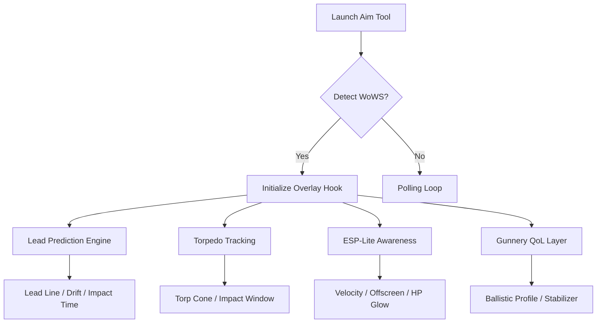

## Overview ⚓

The **World of Warships Aim Tool** is a finely tuned precision suite built to enhance long-range gunnery, torpedo prediction, and engagement timing. Instead of brute-force corrections, it emphasizes subtle visual guidance: lead indicators, shell-time overlays, and movement-aware targeting curves.

[!NOTE]
Every module is optional—toggle only the vision, prediction, or assist layers you need.

---

## Features 🧭

### 🎯 **Lead Prediction Engine**

* **Dynamic Lead Line** – Calculates lead based on ship speed, angle, and shell velocity.
* **Smart Drift Correction** – Adjusts aim when enemies turn or vary throttle.
* **Auto-Elevation Aid** – Helps align vertical shell arc for long shots.
* **Impact Timing Bar** – Displays ETA for shells to reach target.

### 🌊 **Torpedo & Naval Tracking Tools**

* **Torpedo Aim Cone** – Predicts enemy path relative to your torp launch angle.
* **Torpedo Impact Timeline** – Visual countdown to likely hit window.
* **Mid-Course Adjustment Guide** – Predictive hints for dodging or positioning.

### 🔭 **Visual Awareness Enhancements (ESP-Lite)**

* **Enemy Velocity Vector** – Shows direction + acceleration lines.
* **HP & Armor Strip Overlay** – Minimal indicators for weak spots.
* **Off-Screen Enemy Markers** – Arrows pointing toward threats outside FOV.
* **Detectability Ring** – Shows when firing will reveal your ship.

### ⚙️ **Ballistics & Gunnery QoL**

* **Ship-Specific Ballistic Profiles** – Auto-loads per ship type.
* **Long-Range Stabilization Mode** – Reduces shake during high-zoom firing.
* **Shell Arc Preview** – A translucent spline showing expected trajectory.
* **Zoom Snapping Correction** – Prevents overshoot when switching zoom levels.

---


---

## Compatibility 🌐

| Platform            | Support | Notes                      |
| ------------------- | ------- | -------------------------- |
| Windows 10          | ✔       | DX11 & DX12 hybrid overlay |
| Windows 11          | ✔       | Smoothest frame pacing     |
| Steam Version       | ✔       | Fully validated            |
| Wargaming Client    | ✔       | Borderless preferred       |
| Ultrawide 21:9–32:9 | ✔       | Scaling perfect            |

Accessibility includes adjustable colorblind palettes, high-contrast aim lines, and soft-glow overlays for night maps.

---

## Setup ⚡

1. Extract the aim tool package anywhere outside system folders.

2. Launch *World of Warships* in **borderless** or **windowed** mode.

3. Run the aim tool **as administrator**.

4. Select:

   ```text
   WorldOfWarships.exe
   ```

5. Activate modules individually or load a preset.

Quick launch:

```bash
wows-aimtool.exe -p WorldOfWarships.exe -dxhook -profile precision
```

[!WARNING]
Recording overlays (ShadowPlay, MSI OSD, RTSS) may disrupt the hook—disable if needed.

---

## Internal Flow (Mermaid Diagram) 🌐



---

## Example Aim Presets 🎯

### **Battleship Sniper Mode** – Super long-range clarity

* Lead Line: High precision
* Impact Timing: Enabled
* Shell Arc Preview: On
* Velocity Vectors: Off
* Stabilization Mode: High

### **Cruiser Harassment Mode** – Mid-range accuracy

* Lead Line: Medium
* Drift Correction: On
* Torpedo Cone: Off
* Detectability Ring: Enabled
* Zoom Snap Correction: Medium

### **Destroyer Torpedo Specialist** – Predict enemy evasion

* Torpedo Aim Cone: High
* Velocity Vectors: On
* Off-Screen Markers: On
* Impact Time: Enabled
* Lead Correction: Low (guns secondary)

---

## Configuration Example ⚙️

```ini
[AIM]
lead_line=true
lead_precision=1.20
drift_correction=true
impact_timer=true
elevation_assist=true

[TORPEDO]
aim_cone=true
impact_window=true
midcourse_hint=true

[ESP]
velocity_vector=true
hp_glow=false
offscreen_markers=true
detectability_ring=true

[QOL]
shell_arc=true
zoom_snap=0.35
stabilizer=0.45
ballistic_profiles=true
```

---

## Technical Notes 🧪

* Overlay refresh: **60–120 ms**
* DX11/DX12 hybrid allows minimal FPS loss (1–4 FPS typically).
* Presets autosave on exit.
* Offset scanner updates automatically after patches.

[!IMPORTANT]
After major game updates, run the safe-scan before enabling prediction modules.

---

## FAQ ❓

### Is this purely an aim tool or a full cheat suite?

This build focuses on **aiming, prediction, and gunnery QoL** only—no economy, no damage hacks.

### Does it work for carriers?

Yes, but lead prediction focuses on surface ship gunfire and torpedoes.

### Can I disable everything except lead lines?

Absolutely—every module is independent.

### Does ultrawide distort the overlays?

No—the system auto-scales based on aspect ratio.

### Can I share my presets?

Yes—`.ini` files are portable.

---

## Final Thoughts 🌅

War at sea is an art of anticipation. Your guns must fire not where the enemy *is*, but where the future says they *will be*. The **World of Warships Aim Tool** is the quiet mathematics behind that instinct—a companion that traces invisible geometry over the waves, letting you command the horizon with poetic precision.
